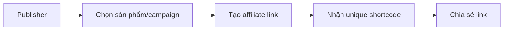
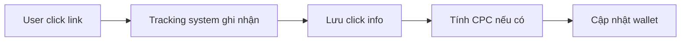
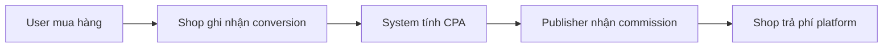
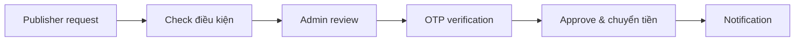

# 🚀 Affiliate Marketing Platform

> **Nền tảng tiếp thị liên kết hoàn chỉnh** được xây dựng bằng Laravel 12, giúp kết nối người bán (Shop) và người tiếp thị (Publisher) để tăng doanh số và chia sẻ lợi nhuận một cách hiệu quả.

[](https://laravel.com)
[](https://php.net)
[](https://mysql.com)
[](LICENSE)

---

## 📋 Mục lục

- [Giới thiệu](#-giới-thiệu)
- [Tính năng chính](#-tính-năng-chính)
- [Công nghệ sử dụng](#️-công-nghệ-sử-dụng)
- [Cài đặt](#-cài-đặt)
- [Cấu trúc dự án](#️-cấu-trúc-dự-án)
- [Workflow](#-workflow)
- [Screenshots](#-screenshots)
- [API Documentation](#-api-documentation)
- [Đóng góp](#-đóng-góp)
- [License](#-license)
- [Liên hệ](#-liên-hệ)

---

## 🎯 Giới thiệu

**Affiliate Marketing Platform** là một hệ thống tiếp thị liên kết toàn diện, được thiết kế để:

- 🛍️ **Shop**: Tăng doanh số bán hàng thông qua mạng lưới publisher
- 📣 **Publisher**: Kiếm thu nhập từ việc quảng bá sản phẩm
- 👨‍💼 **Admin**: Quản lý và giám sát toàn bộ hệ thống

### ✨ Điểm nổi bật

- ⚡ **Real-time tracking** - Theo dõi click và conversion ngay lập tức
- 💰 **Commission system** - Hoa hồng linh hoạt (CPC + CPA)
- 🔒 **Bảo mật cao** - Google OAuth, 2FA, phân quyền chi tiết
- 📊 **Analytics mạnh mẽ** - Dashboard với biểu đồ và thống kê
- 🤖 **AI Chatbot** - Hỗ trợ người dùng tự động
- 📱 **Responsive** - Tương thích mọi thiết bị

---

## 🎨 Tính năng chính

### 👨‍💼 **Hệ thống Admin**

<details>
<summary>Xem chi tiết</summary>

#### Quản lý & Giám sát
- ✅ **Dashboard tổng quan** với thống kê real-time
  - Tổng người dùng (Admin, Shop, Publisher)
  - Tổng sản phẩm và trạng thái
  - Clicks, Conversions, Revenue
  - Biểu đồ xu hướng theo thời gian
  
- ✅ **Quản lý người dùng**
  - CRUD đầy đủ người dùng
  - Phân quyền (Admin/Shop/Publisher)
  - Kích hoạt/vô hiệu hóa tài khoản
  - Quản lý avatar và thông tin cá nhân
  - Xem lịch sử hoạt động

- ✅ **Quản lý sản phẩm**
  - CRUD sản phẩm toàn hệ thống
  - Quản lý danh mục và hình ảnh
  - Phê duyệt sản phẩm từ Shop
  - Thiết lập commission rate
  - Tìm kiếm và lọc nâng cao

- ✅ **Quản lý chiến dịch**
  - Tạo và quản lý campaigns
  - Thiết lập CPC và CPA
  - Theo dõi hiệu suất campaign
  - Gán campaign cho publisher

- ✅ **Quản lý danh mục**
  - CRUD danh mục sản phẩm
  - Upload hình ảnh danh mục
  - Sắp xếp và phân loại

- ✅ **Quản lý affiliate links**
  - Xem tất cả affiliate links
  - Theo dõi clicks và conversions
  - Phân tích hiệu suất link
  - Vô hiệu hóa link không hợp lệ

- ✅ **Quản lý rút tiền**
  - Xem danh sách withdrawal requests
  - Phê duyệt/từ chối yêu cầu
  - OTP verification qua email
  - Multi-level approval workflow
  - Lịch sử giao dịch chi tiết

- ✅ **Quản lý thông báo**
  - Tạo notification templates
  - Gửi thông báo tự động
  - Quản lý thông báo hệ thống
  - Real-time notifications

- ✅ **Quản lý phí nền tảng**
  - Thiết lập platform fee
  - Theo dõi payment từ Shop
  - Thống kê doanh thu nền tảng

- ✅ **Báo cáo và phân tích**
  - Báo cáo doanh thu chi tiết
  - Phân tích hiệu suất publisher
  - Thống kê conversion rate
  - Export dữ liệu Excel

</details>

### 🛒 **Hệ thống Shop**

<details>
<summary>Xem chi tiết</summary>

#### Quản lý Sản phẩm & Bán hàng
- ✅ **Dashboard**
  - Thống kê doanh số bán hàng
  - Số lượng sản phẩm active
  - Clicks và conversions
  - Top products performance
  - Biểu đồ doanh thu theo thời gian

- ✅ **Quản lý sản phẩm**
  - CRUD sản phẩm đầy đủ
  - Upload multi-images
  - Quản lý tồn kho
  - Thiết lập giá và commission
  - Tìm kiếm và lọc sản phẩm
  - **Import/Export Excel** - Nhập xuất hàng loạt
  - Preview trước khi import
  - Validation dữ liệu tự động

- ✅ **Quản lý đơn Publisher**
  - Xem conversions từ publishers
  - Phê duyệt/từ chối đơn hàng
  - Cập nhật trạng thái đơn
  - Tracking shipping

- ✅ **Quản lý Voucher**
  - Tạo mã giảm giá
  - Phân phối cho publishers
  - Theo dõi sử dụng voucher
  - Thiết lập điều kiện áp dụng

- ✅ **Quản lý phí nền tảng**
  - Xem phí phải thanh toán
  - Thanh toán qua VietQR
  - Lịch sử thanh toán

- ✅ **Hồ sơ cá nhân**
  - Cập nhật thông tin shop
  - Upload avatar và banner
  - Thiết lập tài khoản

</details>

### 📢 **Hệ thống Publisher**

<details>
<summary>Xem chi tiết</summary>

#### Kiếm tiền & Tracking
- ✅ **Dashboard**
  - Tổng clicks và conversions
  - Tổng commission (CPC + CPA)
  - Conversion rate
  - Active links count
  - Top performing products
  - Biểu đồ thu nhập theo thời gian
  - Recent conversions

- ✅ **Quản lý sản phẩm**
  - Browse danh sách sản phẩm
  - Xem chi tiết sản phẩm
  - Lọc theo danh mục
  - Tìm kiếm sản phẩm
  - Tạo affiliate link nhanh

- ✅ **Quản lý chiến dịch**
  - Khám phá campaigns
  - Tham gia campaign
  - Tạo affiliate link cho campaign
  - Xem điều kiện và commission
  - Theo dõi performance campaign

- ✅ **Quản lý affiliate links**
  - CRUD affiliate links
  - Tạo custom tracking code
  - Xem clicks và conversions
  - Analytics chi tiết từng link
  - Copy và share link nhanh
  - Theo dõi revenue từng link

- ✅ **Quản lý ví**
  - Xem số dư available và hold
  - Lịch sử transactions
  - Biểu đồ earnings theo tháng
  - Thống kê thu nhập chi tiết
  - Sync wallet realtime
  - Kiểm tra điều kiện rút tiền

- ✅ **Quản lý phương thức thanh toán**
  - Thêm/sửa/xóa tài khoản ngân hàng
  - Validation số tài khoản
  - Xác minh thông tin ngân hàng
  - Thiết lập phương thức ưu tiên

- ✅ **Yêu cầu rút tiền**
  - Tạo withdrawal request
  - Chọn payment method
  - Xem trạng thái withdrawal
  - Lịch sử rút tiền
  - Nhận thông báo real-time

- ✅ **Bảng xếp hạng**
  - Leaderboard publishers
  - Top earners theo tháng
  - Ranking system với tiers
  - Badges và achievements
  - So sánh performance

- ✅ **Hồ sơ cá nhân**
  - Cập nhật thông tin publisher
  - Upload avatar
  - Bio và social links
  - Thiết lập 2FA
  - Đổi mật khẩu

</details>

### 🔗 **Hệ thống Affiliate Tracking**

<details>
<summary>Xem chi tiết</summary>

#### Tracking & Analytics
- ✅ **Link generation** - Tạo unique affiliate links
- ✅ **Click tracking** - Theo dõi clicks real-time
- ✅ **Conversion tracking** - Ghi nhận conversions tự động
- ✅ **Commission calculation** - Tính hoa hồng CPC + CPA
- ✅ **Fraud detection** - Phát hiện click gian lận
- ✅ **Cookie tracking** - Theo dõi user journey
- ✅ **Multi-device tracking** - Cross-device attribution
- ✅ **Deep linking** - Link đến sản phẩm/campaign cụ thể

</details>

### 🔐 **Xác thực và Bảo mật**

<details>
<summary>Xem chi tiết</summary>

#### Security Features
- ✅ **Đăng nhập/Đăng ký** truyền thống
- ✅ **Google OAuth 2.0** - Đăng nhập nhanh
- ✅ **Two-Factor Authentication (2FA)** - Xác thực 2 lớp với Google Authenticator
- ✅ **Password reset** - Quên mật khẩu qua email
- ✅ **Email verification** - Xác thực email
- ✅ **Role-based access control** - Phân quyền chi tiết
- ✅ **Session management** - Quản lý phiên đăng nhập
- ✅ **OTP verification** - OTP cho withdrawal approval
- ✅ **CSRF protection** - Bảo vệ khỏi CSRF attacks
- ✅ **XSS protection** - Lọc input độc hại
- ✅ **SQL injection protection** - Sử dụng Eloquent ORM

</details>

### 🎁 **Tính năng nâng cao**

<details>
<summary>Xem chi tiết</summary>

#### Advanced Features

**🤖 AI Chatbot**
- Hỗ trợ người dùng tự động 24/7
- Tích hợp Gemini AI
- Quick actions theo role
- Context-aware responses
- Lịch sử chat

**💳 VietQR Payment**
- Tạo QR code thanh toán
- Tích hợp VietQR API
- Xác nhận thanh toán tự động
- Multi-bank support

**🔔 Real-time Notifications**
- Thông báo tức thời
- Database notifications
- Email notifications
- Notification templates
- Mark as read/unread
- Notification center

**📊 Advanced Analytics**
- Biểu đồ và charts
- Export Excel
- Custom date ranges
- Performance metrics
- ROI calculation

**🏆 Gamification**
- Publisher ranking system
- Badges và achievements
- Leaderboard
- Tier-based rewards

**💬 Live Chat**
- Chat giữa Shop và Publisher
- Real-time messaging
- File attachments
- Chat history

**📱 Responsive Design**
- Mobile-first approach
- Tablet optimized
- Desktop enhanced
- Touch-friendly UI

</details>

---

## 🛠️ Công nghệ sử dụng

### **Backend Stack**

```
Laravel 12       - PHP Framework hiện đại
PHP 8.2+         - Programming language
MySQL 8.0+       - Relational database
Eloquent ORM     - Database abstraction
Laravel Reverb   - WebSocket server
Queue Jobs       - Background processing
```

### **Frontend Stack**

```
Blade Templates  - Template engine
Bootstrap 5      - CSS framework
JavaScript ES6+  - Modern JavaScript
Chart.js         - Data visualization
Font Awesome 6   - Icon library
Alpine.js        - Lightweight JS framework
```

### **Third-party Services**

```
Google OAuth 2.0          - Social authentication
Google 2FA                - Two-factor auth
VietQR API                - QR payment
Gemini AI                 - AI chatbot
Laravel Socialite         - OAuth integration
Maatwebsite Excel         - Excel import/export
Intervention Image        - Image processing
Bacon QR Code             - QR code generation
```

### **Development Tools**

```
Composer          - PHP dependency manager
NPM               - Node package manager
Vite              - Frontend build tool
Git               - Version control
DDEV              - Local development
Laravel Pail      - Log viewer
Laravel Pint      - Code style fixer
```

### **Database Models**

```php
User                - Quản lý người dùng (Admin/Shop/Publisher)
Product             - Sản phẩm
Category            - Danh mục sản phẩm
Campaign            - Chiến dịch marketing
AffiliateLink       - Link tiếp thị liên kết
Click               - Theo dõi click
Conversion          - Chuyển đổi và đơn hàng
Transaction         - Giao dịch tài chính
PublisherWallet     - Ví của publisher
PublisherRanking    - Xếp hạng publisher
PaymentMethod       - Phương thức thanh toán
Withdrawal          - Yêu cầu rút tiền
WithdrawalApproval  - Phê duyệt rút tiền
Notification        - Thông báo
NotificationTemplate - Template thông báo
Voucher             - Mã giảm giá
PlatformFeeSetting  - Cài đặt phí nền tảng
PlatformFeePayment  - Thanh toán phí
ChatMessage         - Tin nhắn chat
```

---

## 🚀 Cài đặt

### **Yêu cầu hệ thống**

- ✅ PHP >= 8.2
- ✅ Composer >= 2.0
- ✅ MySQL >= 8.0 hoặc MariaDB >= 10.3
- ✅ Node.js >= 16.0
- ✅ NPM >= 8.0
- 🔧 DDEV (recommended cho development)

### **Bước 1: Clone repository**

```bash
git clone https://github.com/ttung205/Affilate-Marketing-Platform
cd ttung-laravel
```

### **Bước 2: Cài đặt dependencies**

```bash
# Install PHP dependencies
composer install

# Install Node dependencies
npm install
```

### **Bước 3: Cấu hình môi trường**

```bash
# Copy file cấu hình
cp .env.example .env

# Generate application key
php artisan key:generate

```

### **Bước 4: Cấu hình database trong `.env`**

```env
DB_CONNECTION=mysql
DB_HOST=127.0.0.1
DB_PORT=3306
DB_DATABASE=ttung_affiliate
DB_USERNAME=root
DB_PASSWORD=your_password
```

### **Bước 5: Cấu hình Google OAuth (optional)**

Tạo credentials tại [Google Cloud Console](https://console.cloud.google.com/)

```env
GOOGLE_CLIENT_ID=your_client_id
GOOGLE_CLIENT_SECRET=your_client_secret
GOOGLE_REDIRECT_URI=http://localhost:8000/auth/google/callback
```

### **Bước 6: Cấu hình Email**

```env
MAIL_MAILER=smtp
MAIL_HOST=smtp.gmail.com
MAIL_PORT=587
MAIL_USERNAME=your_email@gmail.com
MAIL_PASSWORD=your_app_password
MAIL_ENCRYPTION=tls
MAIL_FROM_ADDRESS=your_email@gmail.com
MAIL_FROM_NAME="${APP_NAME}"
```

### **Bước 7: Chạy migration và seeder**

```bash
# Chạy migrations
php artisan migrate

# Chạy seeder để tạo dữ liệu mẫu
php artisan db:seed

# Hoặc chạy seeder cụ thể
php artisan db:seed --class=UserSeeder
php artisan db:seed --class=CategorySeeder
php artisan db:seed --class=ProductSeeder
```

### **Bước 8: Tạo storage link**

```bash
php artisan storage:link
```

### **Bước 9: Build assets**

```bash
# Development
npm run dev

# Production
npm run build
```

### **Bước 10: Khởi chạy ứng dụng**

#### Sử dụng DDEV (Recommended)

```bash
ddev start
ddev exec php artisan serve --host=0.0.0.0
ddev exec php artisan queue:work
ddev exec php artisan reverb:start
```

Truy cập: `https://ttung-laravel.ddev.site`

#### Sử dụng PHP Built-in Server

```bash
# Terminal 1: Web server
php artisan serve

# Terminal 2: Queue worker
php artisan queue:work

# Terminal 3: WebSocket server
php artisan reverb:start

# Terminal 4: Vite dev server
npm run dev
```

Truy cập: `http://localhost:8000`

### **Bước 11: Cache optimization (Production)**

```bash
php artisan config:cache
php artisan route:cache
php artisan view:cache
php artisan optimize
```

---

## 🔐 Tài khoản test

### **Admin Account**
```
Email: admin@example.com
Password: password
```

### **Shop Account**
```
Email: shop@example.com
Password: password
```

### **Publisher Account**
```
Email: publisher@example.com
Password: password
```

---

## 🏗️ Cấu trúc dự án

```
ttung-laravel/
├── app/
│   ├── Console/
│   │   └── Commands/              # Artisan commands
│   ├── Events/                    # Event classes
│   ├── Exports/                   # Excel export classes
│   ├── Http/
│   │   ├── Controllers/
│   │   │   ├── Admin/            # Admin controllers
│   │   │   ├── Publisher/        # Publisher controllers
│   │   │   ├── Shop/             # Shop controllers
│   │   │   └── Auth/             # Authentication controllers
│   │   └── Middleware/           # Custom middleware
│   ├── Imports/                  # Excel import classes
│   ├── Mail/                     # Mail classes
│   ├── Models/                   # Eloquent models
│   ├── Notifications/            # Notification classes
│   ├── Providers/                # Service providers
│   ├── Services/                 # Business logic services
│   │   ├── CacheService.php
│   │   ├── GeminiService.php
│   │   ├── ImageService.php
│   │   ├── NotificationService.php
│   │   ├── PublisherRankingService.php
│   │   ├── PublisherService.php
│   │   ├── SystemInfoService.php
│   │   ├── TwoFactorAuthService.php
│   │   └── VietQRService.php
│   ├── Traits/                   # Reusable traits
│   └── helpers.php               # Helper functions
│
├── config/                       # Configuration files
├── database/
│   ├── migrations/               # Database migrations
│   └── seeders/                  # Database seeders
│
├── public/
│   ├── css/                      # Stylesheets
│   │   ├── admin/               # Admin styles
│   │   ├── publisher/           # Publisher styles
│   │   ├── shop/                # Shop styles
│   │   ├── auth/                # Auth styles
│   │   ├── chatbot/             # Chatbot styles
│   │   ├── components/          # Component styles
│   │   └── notifications/       # Notification styles
│   ├── js/                       # JavaScript files
│   │   ├── admin/
│   │   ├── publisher/
│   │   ├── shop/
│   │   ├── chatbot/
│   │   └── notifications/
│   └── images/                   # Static images
│
├── resources/
│   ├── views/                    # Blade templates
│   │   ├── admin/               # Admin views
│   │   ├── publisher/           # Publisher views
│   │   ├── shop/                # Shop views
│   │   ├── auth/                # Auth views
│   │   ├── components/          # Reusable components
│   │   ├── chatbot/             # Chatbot views
│   │   ├── settings/            # Settings views
│   │   └── notifications/       # Notification views
│   └── lang/                     # Language files
│
├── routes/
│   ├── web.php                   # Web routes
│   ├── channels.php              # Broadcasting channels
│   └── modules/                  # Module routes
│       ├── admin.php
│       ├── publisher.php
│       ├── shop.php
│       ├── auth.php
│       ├── api.php
│       ├── chatbot.php
│       └── tracking.php
│
├── storage/                      # Storage files
│   ├── app/
│   ├── framework/
│   └── logs/
│
├── tests/                        # Test files
├── vendor/                       # Composer dependencies
├── node_modules/                 # NPM dependencies
├── .env                          # Environment config
├── composer.json                 # PHP dependencies
├── package.json                  # Node dependencies
└── vite.config.js               # Vite configuration
```

---

## 🔄 Workflow

### **1. Tạo Link Affiliate**



1. Publisher đăng nhập vào dashboard
2. Browse products hoặc campaigns
3. Tạo affiliate link với custom tracking code
4. Hệ thống tạo unique shortcode
5. Publisher copy link và chia sẻ

### **2. Theo dõi Click**



1. User click vào affiliate link
2. System ghi nhận: IP, device, location, referrer
3. Check valid click (không phải bot, duplicate)
4. Publisher nhận CPC commission nếu có
5. Cộng tiền vào wallet với hold period

### **3. Conversion & Commission**



1. User mua hàng thành công qua affiliate link
2. Shop confirm order trong dashboard
3. System ghi nhận conversion
4. Tính CPA commission cho publisher
5. Cộng tiền vào wallet (hold 7-30 ngày)
6. Shop trả platform fee

### **4. Rút tiền**



1. Publisher tạo withdrawal request
2. Check số dư available >= amount
3. Admin xem và review request
4. Admin nhập OTP để approve
5. System xử lý thanh toán
6. Cập nhật wallet và gửi notification

---

## 📸 Screenshots

### Admin Dashboard


### Publisher Dashboard


### Shop Dashboard


### Affiliate Links Management


### Wallet & Withdrawals


---

## 📚 API Documentation

### Authentication

#### POST `/api/login`
```json
{
  "email": "user@example.com",
  "password": "password"
}
```

#### POST `/api/register`
```json
{
  "name": "John Doe",
  "email": "user@example.com",
  "password": "password",
  "role": "publisher"
}
```

### Affiliate Links

#### GET `/api/affiliate-links`
Lấy danh sách affiliate links của publisher

#### POST `/api/affiliate-links`
```json
{
  "product_id": 1,
  "custom_code": "SUMMER2024"
}
```

### Tracking

#### GET `/track/{shortcode}`
Track click từ affiliate link

---

## 🧪 Testing

### Chạy tests

```bash
# Chạy tất cả tests
php artisan test

# Chạy test cụ thể
php artisan test --filter UserTest

# Chạy với coverage
php artisan test --coverage
```

### Tạo test mới

```bash
php artisan make:test UserTest
php artisan make:test UserTest --unit
```

---

## 📦 Deployment

### Chuẩn bị cho production

```bash
# 1. Cài đặt dependencies (no dev)
composer install --no-dev --optimize-autoloader

# 2. Build assets
npm run build

# 3. Clear và cache
php artisan config:cache
php artisan route:cache
php artisan view:cache
php artisan optimize

# 4. Chạy migrations
php artisan migrate --force

# 5. Link storage
php artisan storage:link
```

### Environment variables cho production

```env
APP_ENV=production
APP_DEBUG=false
APP_URL=https://yourdomain.com

# Database
DB_CONNECTION=mysql
DB_HOST=your_host
DB_PORT=3306
DB_DATABASE=your_database
DB_USERNAME=your_username
DB_PASSWORD=your_secure_password

# Redis (recommended)
REDIS_HOST=127.0.0.1
REDIS_PASSWORD=null
REDIS_PORT=6379

# Queue
QUEUE_CONNECTION=redis

# Cache
CACHE_DRIVER=redis
SESSION_DRIVER=redis
```

---

## 🤝 Đóng góp

Chúng tôi rất hoan nghênh mọi đóng góp! Hãy làm theo các bước sau:

### Quy trình đóng góp

1. **Fork repository**
   ```bash
   git clone https://github.com/ttung205/Affilate-Marketing-Platform
   ```

2. **Tạo branch mới**
   ```bash
   git checkout -b feature/AmazingFeature
   ```

3. **Commit changes**
   ```bash
   git commit -m 'Add some AmazingFeature'
   ```

4. **Push to branch**
   ```bash
   git push origin feature/AmazingFeature
   ```

5. **Mở Pull Request**

### Coding Standards

- Tuân thủ PSR-12 coding standard
- Sử dụng Laravel Pint để format code
- Viết tests cho tính năng mới
- Comment code khi cần thiết
- Tuân thủ naming conventions

### Run code style fixer

```bash
./vendor/bin/pint
```

---

## 📝 Changelog

### Version 1.0.0 (2024-01-01)

#### Added
- ✨ Hệ thống admin dashboard hoàn chỉnh
- ✨ Publisher và Shop dashboards
- ✨ Affiliate tracking system
- ✨ Commission calculation (CPC + CPA)
- ✨ Wallet và withdrawal management
- ✨ Google OAuth integration
- ✨ Two-factor authentication
- ✨ VietQR payment integration
- ✨ AI Chatbot với Gemini
- ✨ Real-time notifications
- ✨ Publisher ranking system
- ✨ Excel import/export
- ✨ Voucher system
- ✨ Platform fee management
- ✨ Live chat support

#### Fixed
- 🐛 Sửa lỗi calculation commission
- 🐛 Fix responsive issues
- 🐛 Optimize database queries

---

## 🔮 Roadmap

### Phiên bản 1.1.0 (Q1 2025)
- [ ] Mobile app (React Native)
- [ ] Multi-language support
- [ ] Advanced analytics dashboard
- [ ] Social media integration
- [ ] Automated marketing tools

### Phiên bản 1.2.0 (Q2 2025)
- [ ] Marketplace for publishers
- [ ] AI-powered product recommendations
- [ ] Video marketing tools
- [ ] Influencer collaboration tools
- [ ] Advanced fraud detection

### Phiên bản 2.0.0 (Q3 2025)
- [ ] Blockchain integration
- [ ] Cryptocurrency payments
- [ ] Decentralized affiliate network
- [ ] NFT rewards system

---

## 📞 Liên hệ

### Tác giả

👨‍💻 **Ttung**

- 📧 **Email**: ttung180205@gmail.com
- 🐙 **GitHub**: [@ttung205](https://github.com/ttung205)

### Support

Nếu bạn gặp vấn đề hoặc có câu hỏi:

1. 📖 Đọc [Documentation](docs/README.md)
2. 🔍 Tìm trong [Issues](https://github.com/ttung125/ttung-laravel/issues)
3. 💬 Tạo [New Issue](https://github.com/ttung125/ttung-laravel/issues/new)
4. 📧 Email: tung18102k5@gmail.com

---

## 🙏 Credits

### Libraries & Tools

- [Laravel](https://laravel.com) - The PHP Framework
- [Bootstrap](https://getbootstrap.com) - Frontend Framework
- [Font Awesome](https://fontawesome.com) - Icons
- [Chart.js](https://chartjs.org) - Charts
- [Google OAuth](https://developers.google.com/identity) - Authentication
- [VietQR](https://vietqr.io) - QR Payment
- [Gemini AI](https://ai.google.dev) - AI Chatbot

### Contributors

Cảm ơn tất cả những người đã đóng góp vào dự án này!

<a href="https://github.com/ttung125/ttung-laravel/graphs/contributors">
  
</a>

---

## ⭐ Hỗ trợ dự án

Nếu bạn thấy dự án này hữu ích, hãy:

- ⭐ **Star** repository này
- 🐛 **Report bugs** và đề xuất tính năng
- 🔀 **Fork** và tạo pull requests
- 📢 **Share** với cộng đồng
- ☕ **Buy me a coffee** để support development

<a href="https://www.buymeacoffee.com/ttung" target="_blank">
  
</a>

---

<div align="center">

### ⭐ **Star this repo if you find it useful!** ⭐

**Built with ❤️ using Laravel 12**

**© 2024 Ttung. All rights reserved.**

[⬆ Back to top](#-affiliate-marketing-platform)

</div>
