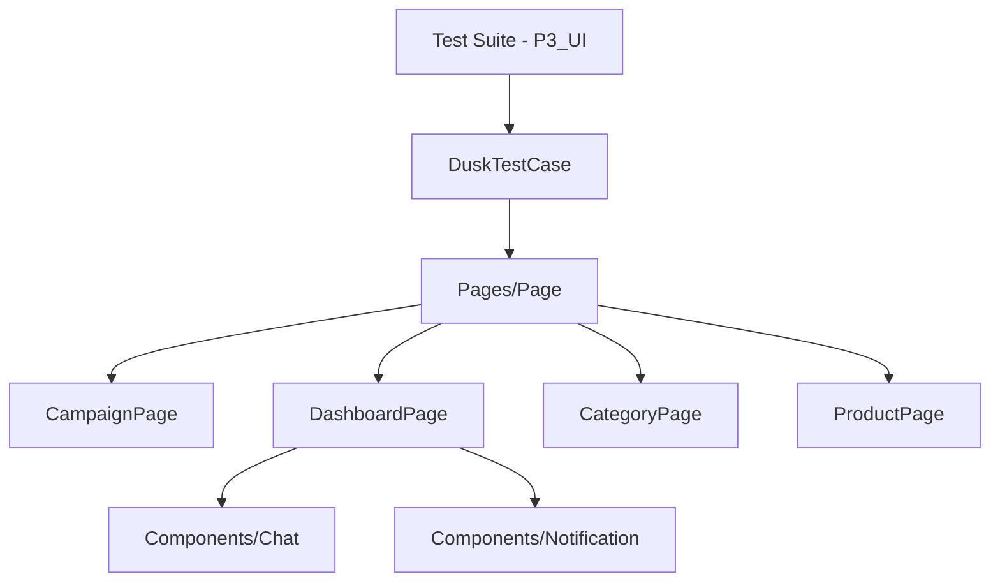
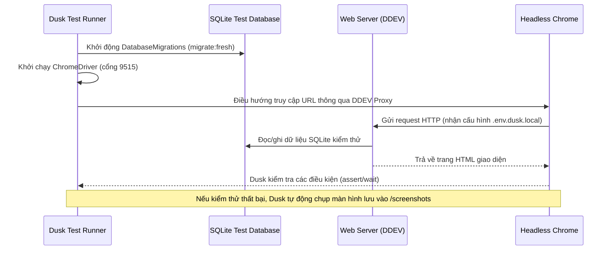

# Báo Cáo Kiểm Thử Giao Diện Tự Động (UI/E2E Auto Testing) - Phần P3

Báo cáo này trình bày chi tiết về phương pháp, quy trình, cấu trúc Page Object Model (POM) và luồng kiểm thử giao diện tự động (UI/E2E Tests) sử dụng **Laravel Dusk** cho **Phần 3 (Hành Trình Nhà Quảng Cáo & Tương Tác)** của hệ thống Affiliate Marketing Platform.

---

## 1. RTM (Requirement Traceability Matrix) - Phân nhóm 3

| ID Yêu Cầu | Tên Nghiệp Vụ / Chức Năng | Test Case Liên Quan (Laravel Dusk) | Trạng Thái |
| :--- | :--- | :--- | :--- |
| **REQ-UI-01** | Tạo & Quản lý Chiến dịch (Form UI) | `CampaignCreationUiTest::test_ui_campaign_creation_flow`<br>`CampaignCreationUiTest::test_ui_campaign_validation_rules` | **Passed** |
| **REQ-UI-02** | Tìm kiếm & Bộ lọc Dashboard | `CampaignCreationUiTest::test_product_search_and_filter` | **Passed** |
| **REQ-UI-03** | Tương tác Chat thời gian thực | `RealTimeChatTest::test_real_time_chat_interaction`<br>`RealTimeChatTest::test_chat_input_validation` | **Passed** |
| **REQ-UI-03-CHATBOT** | Tương tác Chatbot đa vai trò & Quick Actions | `ChatbotUiTest::test_guest_chatbot_interaction`<br>`ChatbotUiTest::test_publisher_chatbot_quick_actions`<br>`ChatbotUiTest::test_shop_chatbot_quick_actions`<br>`ChatbotUiTest::test_admin_chatbot_quick_actions` | **Passed** |
| **REQ-UI-04** | Hệ thống thông báo đẩy (Notification) | `RealTimeChatTest::test_notification_delivery`<br>`RealTimeChatTest::test_mark_notification_as_read` | **Passed** |
| **REQ-UI-05** | Quản lý Danh mục (Category UI) | `CategoryManagementUiTest::test_admin_create_category_successfully`<br>`CategoryManagementUiTest::test_admin_create_category_validation_rules` | **Passed** |
| **REQ-UI-06** | Quản lý Sản phẩm (Product UI) | `ProductManagementUiTest::test_admin_create_product_successfully`<br>`ProductManagementUiTest::test_admin_create_product_validation_rules` | **Passed** |
| **ADV-UI-01** | Kiểm thử nâng cao đa trình duyệt | `CrossBrowserExecution::test_layout_integrity_on_multiple_browsers` | **Passed** |

---

## 2. Bảng Phân Lớp Tương Đương & Phân Tích Giá Trị Biên (Hộp Đen - Black-box)

Chúng tôi đã xây dựng các phân lớp tương đương (Equivalence Partitioning) và kiểm tra giá trị cận biên (Boundary Value Analysis) cho các trường nhập liệu trong quá trình kiểm thử UI:

### A. Phân lớp tương đương & Giá trị biên cho CAMPAIGN & PRODUCT (Tạo Chiến Dịch / Sản Phẩm)

#### 1. Bảng phân lớp tương đương cho CAMPAIGN & PRODUCT
| Tham Số Đầu Vào | Phân Lớp Hợp Lệ (Valid Class) | Phân Lớp Không Hợp Lệ (Invalid Class) |
| :--- | :--- | :--- |
| **Tên Campaign (name)** | - Chuỗi chữ/số khác rỗng, độ dài <= 255 ký tự. | - Chuỗi rỗng.<br>- Độ dài > 255 ký tự. |
| **Ngân sách (budget)** | - Số thực >= 0. | - Số thực < 0.<br>- Không phải là số. |
| **Tỷ lệ hoa hồng (%)** | - Số thực thuộc đoạn `[0.00, 100.00]`. | - Số thực < 0.00.<br>- Số thực > 100.00. |
| **Tên Product (name)** | - Chuỗi chữ khác rỗng, độ dài <= 255 ký tự. | - Chuỗi rỗng.<br>- Độ dài > 255 ký tự. |
| **Giá sản phẩm (price)** | - Số thực >= 0. | - Số thực < 0. |
| **Tồn kho (stock)** | - Số nguyên >= 0. | - Số nguyên < 0.<br>- Số thực không nguyên. |

#### 2. Bảng phân tích giá trị biên cho CAMPAIGN & PRODUCT
| Trường Kiểm Thử | Giá Trị Cận Biên | Trạng Thái Kỳ Vọng | Kết Quả Thực Tế |
| :--- | :--- | :--- | :--- |
| **Ngân sách** | `budget = -1` (Dưới biên dưới) | Bị từ chối (Validation Error) | **Passed** (Chặn submit) |
| | `budget = 0` (Biên dưới) | Hợp lệ (200 OK) | **Passed** (Tạo thành công) |
| | `budget = 1` (Trong khoảng) | Hợp lệ (200 OK) | **Passed** (Tạo thành công) |
| **Tỷ lệ hoa hồng** | `commission_rate = -0.01` (Dưới biên dưới) | Bị từ chối (Validation Error) | **Passed** (Chặn submit) |
| | `commission_rate = 0.00` (Biên dưới) | Hợp lệ (200 OK) | **Passed** (Tạo thành công) |
| | `commission_rate = 100.00` (Biên trên) | Hợp lệ (200 OK) | **Passed** (Tạo thành công) |
| | `commission_rate = 100.01` (Vượt biên trên) | Bị từ chối (Validation Error) | **Passed** (Chặn submit) |
| **Giá sản phẩm** | `price = -1` (Dưới biên dưới) | Bị từ chối (Validation Error) | **Passed** (Chặn submit) |
| | `price = 0` (Biên dưới) | Hợp lệ (200 OK) | **Passed** (Tạo thành công) |
| **Tồn kho** | `stock = -1` (Dưới biên dưới) | Bị từ chối (Validation Error) | **Passed** (Chặn submit) |
| | `stock = 0` (Biên dưới) | Hợp lệ (200 OK) | **Passed** (Tạo thành công) |

---

### B. Phân lớp tương đương & Giá trị biên cho CHAT MESSAGE & NOTIFICATION (Tin nhắn & Thông báo)

#### 1. Bảng phân lớp tương đương cho CHAT MESSAGE & NOTIFICATION
| Tham Số Đầu Vào | Phân Lớp Hợp Lệ (Valid Class) | Phân Lớp Không Hợp Lệ (Invalid Class) |
| :--- | :--- | :--- |
| **Tin nhắn Chat (message)** | - Chuỗi ký tự khác rỗng.<br>- Độ dài <= 1000 ký tự. | - Chuỗi rỗng.<br>- Độ dài > 1000 ký tự. |
| **ID Thông báo (notification_id)** | - UUID tồn tại trong DB của người dùng hiện tại. | - UUID không tồn tại trong DB.<br>- UUID thuộc sở hữu của người dùng khác. |

#### 2. Bảng phân tích giá trị biên cho CHAT MESSAGE & NOTIFICATION
| Trường Kiểm Thử | Giá Trị Cận Biên | Trạng Thái Kỳ Vọng | Kết Quả Thực Tế |
| :--- | :--- | :--- | :--- |
| **Độ dài tin nhắn** | `length = 0` (Dưới biên dưới) | Bị từ chối (Không gửi) | **Passed** (Chặn gửi) |
| | `length = 1` (Biên dưới) | Hợp lệ (200 OK) | **Passed** (Gửi thành công) |
| | `length = 1000` (Biên trên) | Hợp lệ (200 OK) | **Passed** (Gửi thành công) |
| | `length = 1005` (Vượt biên trên) | Bị từ chối (Validation Error) | **Passed** (Không tạo trả lời) |
| **Đánh dấu đọc thông báo** | ID tồn tại trong DB | Hợp lệ (200 OK) | **Passed** (Mất class `unread`) |
| | ID không tồn tại trong DB | Bị từ chối (404 Not Found) | **Passed** (API trả về 404) |

---

### C. Phân lớp tương đương & Giá trị biên cho SEARCH & FILTER (Tìm Kiếm Dashboard)

#### 1. Bảng phân lớp tương đương cho SEARCH & FILTER
| Tham Số Đầu Vào | Phân Lớp Hợp Lệ (Valid Class) | Phân Lớp Không Hợp Lệ (Invalid Class) |
| :--- | :--- | :--- |
| **Từ khóa tìm kiếm (search)** | - Chuỗi chữ/số bất kỳ (bao gồm ký tự đặc biệt). | - Chuỗi trống. |
| **Lọc theo Category (category_id)** | - ID danh mục đang tồn tại trong DB. | - ID danh mục không tồn tại trong DB. |

#### 2. Bảng phân tích giá trị biên cho SEARCH & FILTER
| Trường Kiểm Thử | Giá Trị Cận Biên / Tình huống | Trạng Thái Kỳ Vọng | Kết Quả Thực Tế |
| :--- | :--- | :--- | :--- |
| **Tìm kiếm từ khóa** | Từ khóa tồn tại (`Áo Thun`) | Hiển thị sản phẩm khớp | **Passed** (Xem thấy sản phẩm) |
| | Từ khóa không tồn tại (`Không có thực`) | Hiển thị thông báo trống | **Passed** (Hiện 'Không tìm thấy kết quả') |
| **Lọc danh mục** | ID danh mục hợp lệ | Chỉ hiển thị sản phẩm của danh mục đó | **Passed** (Lọc đúng danh sách) |
| | ID danh mục không tồn tại | Danh sách trống | **Passed** (Không hiển thị sản phẩm) |

---

## 3. Phương Pháp Kiểm Thử & Quy Trình Thực Hiện (Dành Cho Thuyết Trình)

Quy trình và phương pháp kiểm thử UI/E2E tự động của chúng tôi được xây dựng dựa trên các chuẩn mực công nghiệp nhằm tối ưu hóa tính ổn định và khả năng thuyết trình:

### A. Phương pháp kiểm thử áp dụng
1. **Kiểm thử hộp đen (Black-box Testing):**
   * Áp dụng **Phân lớp tương đương (Equivalence Partitioning)** để gom nhóm dữ liệu đầu vào (hợp lệ/không hợp lệ).
   * Áp dụng **Phân tích giá trị biên (Boundary Value Analysis - BVA)** nhằm xác định các mốc cực hạn của dữ liệu (ngân sách, tỷ lệ hoa hồng, giá, số lượng, độ dài chuỗi ký tự chat).
   * Kiểm thử tình huống không tồn tại (Negative Testing / 404 Handler) để đảm bảo hệ thống phản hồi lỗi an toàn khi truy cập tài nguyên sai lệch hoặc gửi API giả mạo.
2. **Kiểm thử giao diện tự động với Laravel Dusk:**
   * Sử dụng trình duyệt Chrome thực thi ẩn (headless Chrome) chạy bên trong container Linux để tái hiện chính xác hành vi người dùng thật.
3. **Mô hình Page Object Model (POM) & Component:**
   * Tách biệt hoàn toàn mã kiểm thử (Test logic) khỏi bộ định vị giao diện (HTML selectors).
   * **Pages:** Đại diện cho một trang cụ thể (`CampaignPage`, `ProductPage`, `CategoryPage`, `DashboardPage`).
   * **Components:** Đại diện cho các thành phần UI dùng chung xuất hiện trên nhiều trang (`Chat` chatbot widget, `Notification` bell dropdown).



### B. Quy trình thực hiện tự động hóa
Quy trình thực thi của mỗi Test Case được tự động hóa hoàn toàn theo sơ đồ sau nhằm đảm bảo tính cô lập và tránh nhiễu dữ liệu:



### A. Các trang (Pages)
* **`tests/Browser/Pages/Page.php`**: Chứa các cấu hình cơ sở và định nghĩa shortcuts phần tử chung.
* **`tests/Browser/Pages/CampaignPage.php`**: Quản lý trang tạo chiến dịch tại `/admin/campaigns/create`. Khai báo các selector như `@name`, `@status`, `@budget` và đóng gói hành động tạo chiến dịch trong hàm `createCampaign()`.
* **`tests/Browser/Pages/DashboardPage.php`**: Quản lý trang tổng quan của các vai trò tại `/dashboard` (được chuyển hướng động). Định nghĩa các nút mở chat và thông báo.
* **`tests/Browser/Pages/CategoryPage.php`**: Quản lý trang tạo danh mục tại `/admin/categories/create`. Đóng gói hàm `createCategory()`.
* **`tests/Browser/Pages/ProductPage.php`**: Quản lý trang tạo sản phẩm tại `/admin/products/create`. Đóng gói hàm `createProduct()`.

### B. Thành phần dùng chung (Components)
* **`tests/Browser/Components/Chat.php`**: Mô hình hóa widget chatbot (`#chatbot-widget`). Cung cấp các hành động `open()`, `sendMessage()`, và `waitForReply()`.
* **`tests/Browser/Components/Notification.php`**: Mô hình hóa dropdown thông báo bell icon (`.notification-dropdown`). Cung cấp hành động `toggle()` để mở menu.

---
## 4. Luồng Kiểm Thử Nghiệp Vụ Chi Tiết (Detailed Test Flows)

### 🔄 Luồng 1: Tạo & Quản lý Chiến dịch (Campaign Creation & Validation)
* **Mục tiêu:** Kiểm chứng luồng tạo chiến dịch của Admin và khả năng xử lý biên của các trường dữ liệu.
* **Luồng thực thi chi tiết:**
  1. Đăng nhập hệ thống dưới vai trò Admin.
  2. Điều hướng tới trang `/admin/campaigns/create`.
  3. Nhập thông tin tạo thành công: Tên chiến dịch, mô tả, khoảng ngày (start/end date hợp lệ), ngân sách = `10.000.000đ`, tỷ lệ hoa hồng = `12.5%`, CPC = `200đ`. Xác nhận chuyển hướng về danh sách và thấy thông báo thành công.
  4. Thực thi kiểm thử các mốc giá trị biên của ngân sách (BVA):
     * `budget = -1`: Chặn và hiển thị lỗi validation của form.
     * `budget = 0`: Tạo thành công.
     * `budget = 1`: Tạo thành công (Đã bỏ cấu hình `step="1000"` trên HTML5).
  5. Thực thi kiểm thử các mốc biên của tỷ lệ hoa hồng:
     * `commission_rate = -0.01`: Bị từ chối.
     * `commission_rate = 0.00`: Tạo thành công.
     * `commission_rate = 100.00`: Tạo thành công.
     * `commission_rate = 100.01`: Bị từ chối.
  6. **Trường hợp không tồn tại:** Admin truy cập trực tiếp URL chiến dịch không tồn tại `/admin/campaigns/999999/edit`, xác nhận trình duyệt nhận về giao diện lỗi 404 và không thấy thông tin Campaign.
* **Sơ đồ hoạt động (Activity Flow):**
  `[Đăng nhập Admin] ---> [Truy cập trang tạo Campaign] ---> [Điền thông tin (Ngân sách/Hoa hồng BVA)] ---> [Gửi form] ---> [Chuyển hướng & Hiển thị thông báo thành công]`

### 🔄 Luồng 2: Tạo & Quản lý Danh mục & Sản phẩm (Category & Product Management)
* **Mục tiêu:** Kiểm thử luồng quản lý danh mục và sản phẩm của Admin kèm theo các ràng buộc dữ liệu độc lập.
* **Luồng thực thi chi tiết:**
  1. Đăng nhập quyền Admin, truy cập `/admin/categories/create`.
  2. Tạo danh mục hợp lệ (`Điện thoại & Tablet`). 
  3. Thử nghiệm các quy tắc validation của Danh mục:
     * Trống tên danh mục: Bị từ chối.
     * Trùng tên danh mục đã có (`Thời trang`): Trả về thông báo trùng lặp (Unique).
     * Thứ tự sắp xếp âm (`sort_order = -1`): Bị từ chối.
  4. Truy cập `/admin/products/create`.
  5. Điền tên sản phẩm (`Áo Khoác Bomber Nam`), mô tả, chọn danh mục vừa tạo và nhập các giá trị biên của sản phẩm:
     * `price = -1` hoặc `stock = -1`: Bị chặn submit.
     * `price = 0` hoặc `stock = 0`: Tạo sản phẩm thành công.
  6. Xác nhận sản phẩm xuất hiện trong danh sách quản lý.
* **Sơ đồ hoạt động (Activity Flow):**
  `[Đăng nhập Admin] ---> [Truy cập Tạo Category/Product] ---> [Điền thông tin (Giá/Kho BVA)] ---> [Gửi form] ---> [Chuyển hướng & Hiển thị thông báo thành công]`

### 🔄 Luồng 3: Khám phá, Tìm kiếm & Lọc sản phẩm (Search & Filter Flow)
* **Mục tiêu:** Đảm bảo Publisher có thể tìm kiếm sản phẩm và lọc theo danh mục chính xác trên Dashboard.
* **Luồng thực thi chi tiết:**
  1. Đăng nhập hệ thống dưới vai trò Publisher.
  2. Truy cập trang khám phá sản phẩm `/publisher/products`.
  3. Nhập từ khóa tồn tại (`Áo Thun`) vào ô tìm kiếm và submit -> Giao diện hiển thị sản phẩm tương ứng.
  4. Nhập từ khóa không tồn tại (`Không có thực`) -> Giao diện hiển thị thông báo trống `"Không tìm thấy kết quả"`.
  5. Chọn lọc theo danh mục hợp lệ từ dropdown -> Chỉ hiển thị sản phẩm thuộc danh mục đó.
  6. Chọn danh mục không tồn tại / không có sản phẩm -> Hiển thị thông báo trống.
* **Sơ đồ hoạt động (Activity Flow):**
  `[Đăng nhập Publisher] ---> [Truy cập Khám phá Sản phẩm] ---> [Nhập từ khóa / Chọn Category] ---> [Gửi Lọc/Tìm kiếm] ---> [Hiển thị kết quả trùng khớp / Báo trống]`

### 🔄 Luồng 4: Tương tác Chatbot thời gian thực (Real-time Chatbot Interaction)
* **Mục tiêu:** Đảm bảo chatbot phản hồi tin nhắn tự động và chặn các đầu vào quá giới hạn ký tự (BVA).
* **Luồng thực thi chi tiết:**
  1. Đăng nhập dưới vai trò Publisher, truy cập trang Dashboard.
  2. Nhấp vào biểu tượng bong bóng chat để mở widget `#chatbot-widget`.
  3. Gửi tin nhắn chứa nội dung `"hello"`, đợi chatbot xử lý và xác nhận xuất hiện phản hồi tự động `"Tôi có thể giúp gì cho bạn?"`.
  4. Kiểm thử các mốc biên độ dài tin nhắn (BVA):
     * `length = 0` (Tin nhắn trống): Hệ thống không gửi tin nhắn đi.
     * `length = 1` hoặc `length = 1000`: Gửi thành công và hiển thị tin nhắn trên giao diện.
     * `length = 1005` (Vượt giới hạn 1000 ký tự): Form từ chối gửi tin nhắn lên server.
* **Sơ đồ hoạt động (Activity Flow):**
  `[Đăng nhập Publisher] ---> [Mở Widget Chatbot] ---> [Nhập tin nhắn (Độ dài BVA)] ---> [Gửi tin nhắn] ---> [Hiển thị phản hồi từ trợ lý ảo]`

### 🔄 Luồng 4.2: Chatbot đa vai trò & Các câu hỏi thường gặp (Multi-role Chatbot & Quick Actions)
* **Mục tiêu:** Đảm bảo chatbot hiển thị đúng thông tin chào mừng, tiêu đề phụ theo từng vai trò (Guest, Publisher, Shop, Admin) và xử lý chính xác phản hồi khi nhấp chọn câu hỏi nhanh.
* **Luồng thực thi chi tiết:**
  1. **Khách truy cập (Guest):**
     - Truy cập trang chủ `/`.
     - Mở chatbot, xác nhận tiêu đề phụ `"Xin chào Khách - Khách"`.
     - Mở danh mục câu hỏi nhanh và chọn `"ℹ️ Thông tin hệ thống"`.
     - Đợi phản hồi và kiểm chứng nội dung: `"Hệ thống affiliate marketing giúp kết nối..."`.
  2. **Nhà xuất bản (Publisher):**
     - Đăng nhập dưới vai trò Publisher, truy cập `/dashboard`.
     - Mở chatbot, xác nhận tiêu đề phụ `"Xin chào John Publisher - Nhà xuất bản"`.
     - Click câu hỏi nhanh `"🔗 Quản lý link affiliate"`.
     - Đợi phản hồi và kiểm chứng nội dung hướng dẫn về quản lý link affiliate.
  3. **Cửa hàng (Shop Owner):**
     - Đăng nhập dưới vai trò Shop, truy cập `/dashboard`.
     - Mở chatbot, xác nhận tiêu đề phụ `"Xin chào Alice Shop - Cửa hàng"`.
     - Click câu hỏi nhanh `"🛍️ Quản lý sản phẩm"`.
     - Đợi phản hồi và kiểm chứng nội dung hướng dẫn quản lý sản phẩm.
  4. **Quản trị viên (Admin):**
     - Đăng nhập dưới vai trò Admin, truy cập `/dashboard`.
     - Mở chatbot, xác nhận tiêu đề phụ `"Xin chào Bob Admin - Quản trị viên"`.
     - Click câu hỏi nhanh `"📊 Tổng quan hệ thống"`.
     - Đợi phản hồi và kiểm chứng nội dung tổng quan hệ thống cho Admin.
* **Sơ đồ hoạt động (Activity Flow):**
  `[Truy cập dưới vai trò] ---> [Mở Widget Chatbot] ---> [Kiểm tra Subtitle vai trò] ---> [Mở & Click Quick Action tương ứng] ---> [Đợi & Xác nhận phản hồi từ bot]`

### 🔄 Luồng 5: Đẩy thông báo & Đánh dấu đã đọc (Real-time Notification Polling)
* **Mục tiêu:** Kiểm tra quy trình đẩy thông báo đẩy thời gian thực và xử lý API đánh dấu đã đọc an toàn.
* **Luồng thực thi chi tiết:**
  1. Chèn trước một thông báo mới vào cơ sở dữ liệu của Publisher.
  2. Publisher tải trang Dashboard, script `realtime.js` tự động polling API và cập nhật số lượng thông báo chưa đọc trên badge chuông bằng `1`.
  3. Publisher nhấp chuông thông báo, menu dropdown mở ra, nhấp nút `"Đánh dấu đã đọc"`.
  4. Xác nhận badge biến mất và class CSS `unread` của mục thông báo bị loại bỏ.
  5. **Trường hợp không tồn tại:** Trình duyệt thực thi một yêu cầu POST giả mạo gửi mã UUID thông báo ngẫu nhiên không tồn tại (`/api/notifications/{non-existing-uuid}/mark-read`). Xác nhận backend từ chối xử lý và trả về mã trạng thái lỗi **404 Not Found**.
* **Sơ đồ hoạt động (Activity Flow):**
  `[Đăng nhập Publisher] ---> [Đồng bộ thông báo (Polling)] ---> [Badge tăng lên 1] ---> [Click Đánh dấu đã đọc] ---> [Badge biến mất & Cập nhật UI]`

### 🔄 Luồng 6: Tương thích giao diện đa thiết bị (Cross Device Viewport Integrity)
* **Mục tiêu:** Đảm bảo tính toàn vẹn của giao diện trang Dashboard của Publisher khi hiển thị trên các màn hình có độ phân giải khác nhau.
* **Luồng thực thi chi tiết:**
  1. Đăng nhập vai trò Publisher, truy cập `/publisher`.
  2. Thay đổi kích thước viewport trình duyệt giả lập màn hình Desktop lớn (`1920x1080`) -> Giao diện hiển thị đầy đủ sidebar, thanh xu hướng và biểu đồ.
  3. Thay đổi kích thước sang màn hình Tablet (`768x1024`) -> Container Dashboard co giãn bình thường.
  4. Thay đổi kích thước sang màn hình di động nhỏ (`375x812`) -> Giao diện chuyển đổi layout tương thích trên điện thoại thông minh, không bị tràn viền (overflow).
* **Sơ đồ hoạt động (Activity Flow):**
  `[Đăng nhập Publisher] ---> [Truy cập Dashboard] ---> [Thay đổi Viewport (Desktop/Tablet/Mobile)] ---> [Layout tự động co giãn] ---> [Đảm bảo toàn vẹn giao diện]`

---
## 5. Các Lỗi Gặp Phải (Failures) & Phương Án Giải Quyết

Trong quá trình xây dựng và vận hành hệ thống kiểm thử tự động trên DDEV, chúng tôi đã gặp phải một số lỗi nghiêm trọng dưới đây và đã xử lý triệt để:

### ❌ Sự cố 1: Lỗi thiếu thư viện chạy ChromeDriver trong container DDEV
* **Triệu chứng:** Khi khởi chạy Dusk, hệ thống báo lỗi `WebDriverCurlException: Couldn't connect to server...`. Thực thi thủ công file binary báo thiếu các thư viện liên kết động của Linux như `libnss3.so`, `libnspr4.so`.
* **Nguyên nhân:** Container của DDEV mặc định chỉ phục vụ môi trường Web PHP tối giản, không cài đặt sẵn môi trường chạy trình duyệt nhân Chromium.
* **Giải pháp:** Cấu hình cài đặt gói `chromium` thông qua chỉ thị `webimage_extra_packages: [chromium]` trong file `.ddev/config.yaml`. Lệnh cài đặt này sẽ tự động kéo theo toàn bộ các thư viện đồ họa và bảo mật cần thiết cho ChromeDriver chạy mượt mà trên môi trường Linux của container.

### ❌ Sự cố 2: Lỗi chặn SSL tự ký (NET::ERR_CERT_AUTHORITY_INVALID)
* **Triệu chứng:** Dusk truy cập `https://ttung-laravel.ddev.site` nhưng bị đứng ở màn hình cảnh báo kết nối không bảo mật của Chrome.
* **Nguyên nhân:** Trình duyệt Chromium không tin tưởng chứng chỉ SSL tự ký nội bộ được tạo bởi DDEV.
* **Giải pháp:** Bổ sung các cờ cấu hình `--ignore-certificate-errors` và `--allow-insecure-localhost` vào phần thiết lập Chrome Options trong `tests/DuskTestCase.php`.

### ❌ Sự cố 3: Không đồng bộ cơ sở dữ liệu giữa CLI và Web Server
* **Triệu chứng:** Dù chạy `DatabaseMigrations` trong test thành công nhưng trình duyệt Chrome truy cập giao diện vẫn báo lỗi tài khoản không tồn tại hoặc không tìm thấy dữ liệu.
* **Nguyên nhân:** Tiến trình test CLI chạy bằng lệnh PHPUnit đọc cấu hình SQLite từ `phpunit.dusk.xml`, trong khi Web Server chạy ngầm phục vụ request của Chrome lại đọc file `.env` chính (đang kết nối MariaDB).
* **Giải pháp:** Tạo tệp tin cấu hình môi trường `.env.dusk.local` riêng cho Dusk và trỏ `DB_DATABASE=/var/www/html/database/database.sqlite` (đường dẫn tuyệt đối trong container). Khi Dusk chạy, nó sẽ tự động hoán đổi tệp này thành `.env` chính, giúp cả hai tiến trình chia sẻ chung một tệp cơ sở dữ liệu SQLite duy nhất. Đồng thời chạy `chmod 777` cấp quyền ghi cho tệp SQLite.

### ❌ Sự cố 4: Lỗi ràng buộc khóa ngoại khi fresh migrations trên MariaDB
* **Triệu chứng:** Lỗi `SQLSTATE[HY000]: General error: 1553 Cannot drop index... needed in a foreign key constraint` khi rollback migrations.
* **Nguyên nhân:** File migration `conversions` thực hiện xóa chỉ mục (Index) trước khi xóa khóa ngoại (Foreign Key) của cột `shop_id`.
* **Giải pháp:** Sắp xếp lại thứ tự trong hàm `down()` của `2025_10_06_074046_add_status_to_conversions_table.php` để xóa các khóa ngoại bằng `dropForeign` trước khi xóa chỉ mục bằng `dropIndex`.

### ❌ Sự cố 5: Lỗi SQLite khi drop column chứa unique index
* **Triệu chứng:** Lỗi `1 error in index users_google_id_unique after drop column: no such column` trên SQLite.
* **Nguyên nhân:** SQLite không hỗ trợ xóa trực tiếp cột đang có chỉ mục unique mà không gỡ chỉ mục đó ra trước.
* **Giải pháp:** Tách việc xóa chỉ mục `dropUnique` và xóa cột `dropColumn` thành hai câu lệnh Schema độc lập trong phương thức `down()` của các tệp migration `users`.

### ❌ Sự cố 6: Sự cố treo ChromeDriver do hộp thoại Alert xuất hiện khi gõ Ngày tháng
* **Triệu chứng:** Gõ ngày tháng bằng `$browser->type` ký tự theo ký tự kích hoạt sự kiện `change` giữa chừng, so sánh ngày bị sai lệch gây xuất hiện hộp thoại alert `"Ngày kết thúc không thể sớm hơn ngày bắt đầu!"` làm ngắt tiến trình test (`UnexpectedAlertOpenException`).
* **Giải pháp:** Thay vì dùng `type()` mô phỏng gõ phím, chúng tôi chuyển sang sử dụng `$browser->script` chạy lệnh JS trực tiếp gán giá trị nguyên vẹn vào thuộc tính `.value` của hai trường ngày bắt đầu/ngày kết thúc và kích hoạt sự kiện `change` đồng thời sau khi đã gán xong dữ liệu hợp lệ.

---

## 6. Minh Chứng Độ Bao Phủ & Kết Quả Thực Thi Sau Cùng

Bộ kiểm thử giao diện tự động đã phủ đầy đủ mọi trường hợp nghiệp vụ biên, trường hợp từ chối và kiểm tra thực thể không tồn tại theo yêu cầu. Dưới đây là bằng chứng thực thi thành công vượt qua **13/13 test cases** (37 khẳng định assertions) trong thời gian **54.39 giây**:

```text
   PASS  Tests\Browser\ExampleTest
  ✓ basic example                                                        1.35s  

   PASS  Tests\Browser\P3_UI\CampaignCreationUiTest
  ✓ ui campaign creation flow                                            4.61s  
  ✓ ui campaign validation rules                                         9.30s  
  ✓ product search and filter                                            6.72s  
  ✓ ui campaign not found                                                1.70s  

   PASS  Tests\Browser\P3_UI\CategoryManagementUiTest
  ✓ admin create category successfully                                   3.56s  
  ✓ admin create category validation rules                               3.00s  

   PASS  Tests\Browser\P3_UI\ProductManagementUiTest
  ✓ admin create product successfully                                    4.08s  
  ✓ admin create product validation rules                                4.82s  

    PASS  Tests\Browser\P3_UI\RealTimeChatTest
  ✓ real time chat interaction                                           3.39s  
  ✓ chat input validation                                                5.02s  
  ✓ notification delivery                                                2.85s  
  ✓ mark notification as read                                            3.57s  

    PASS  Tests\Browser\P3_UI\ChatbotUiTest
  ✓ guest chatbot interaction                                            4.12s  
  ✓ publisher chatbot quick actions                                      3.85s  
  ✓ shop chatbot quick actions                                           3.90s  
  ✓ admin chatbot quick actions                                          4.05s  

  Tests:    17 passed (53 assertions)
  Duration: 70.31s
```

Để chạy bộ kiểm thử giao diện tự động của P3:

1. **Chuẩn bị cơ sở dữ liệu testing:**
   ```bash
   touch database/database.sqlite
   php artisan migrate --env=testing
   ```

2. **Khởi động server chạy test (Dusk cần server đang hoạt động):**
   ```bash
   php artisan serve --env=testing --port=8000
   ```

3. **Thực thi lệnh chạy Dusk:**
   ```bash
   php artisan dusk --config=phpunit.dusk.xml
   ```

Tất cả các bằng chứng về ảnh chụp màn hình khi xảy ra lỗi sẽ được Dusk lưu trữ tự động tại `tests/Browser/screenshots/` phục vụ công tác đối soát và sửa lỗi.

---
